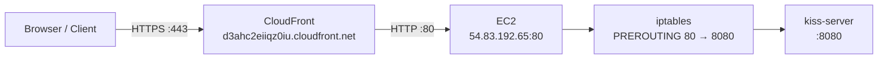

# Architecture

The kiss-server is a from-scratch HTTP/1.1 static file server written in pure Rust. No external
dependencies beyond the `log` crate facade. This document explains the core design patterns and key
decisions.

## Handler, Context, and Router

The request pipeline is built around three types that work together:

- **Handler trait**: `fn handle(&self, ctx: &mut Context) -> Result<()>` — any struct implementing
  Handler can process requests. In-place mutation of Context avoids future reconstruction overhead.
  Handlers must be `Send + Sync` because they are shared across worker threads via `Arc<Router>`.
  Returning `Err` causes the server to send a 500 response.

- **Context**: Wraps the incoming `Request` and the outgoing `Response` for a single HTTP
  request and response cycle. Constructed per-request in `handle_connection`. Handlers read the request
  from `ctx.request` and write the response into `ctx.response` in place.

- **Router**: Maps URL paths to Handler implementations via a registration list. Routes are checked
  in registration order; the first match wins. Uses `set_fallback()` for the static file handler —
  unmatched routes fall through to file serving rather than returning 404 immediately. The safety
  guard (dot-dot rejection, invalid %-sequences) runs before any handler, including the fallback.

In production, no routes are registered on the router. The `StaticFileHandler` is installed as the
fallback, so every request goes to file serving. Named routes exist for tests and future use.

## Thread Pool

- Fixed-size thread pool (default 4 workers, configurable via CLI) for concurrent connection
  handling.
- Synchronous blocking I/O — each connection gets a thread from the pool for the full duration of
  handling.
- No async runtime (no tokio). The thread pool is enough for the project's goals and keeps the
  implementation simple.
- Worker threads receive jobs via a shared `mpsc` channel behind a `Mutex<Receiver>`. Each worker
  holds `Arc<Mutex<Receiver<Job>>>` and calls `lock().unwrap_or_else(...)` to recover from mutex
  poison.
- Graceful-ish shutdown: the `Drop` implementation drops the sender (closing the channel), then
  joins all worker threads. `let _ = thread.join()` it avoids panic propagation if a worker
  panicked.

## Static File Serving

- `StaticFileHandler` implements the Handler trait and is installed as the router's fallback.
- Serves files from a configurable root directory (`--root` CLI argument, required at startup).
- Binary-safe reads — files are read as `Vec<u8>` via `fs::read()`, not as strings.
- MIME detection from file extension (10 types: `html`, `css`, `js`, `wasm`, `png`, `jpg`, `jpeg`,
  `gif`, `svg`, `ico`, `txt`; with `application/octet-stream` fallback).
- Directory requests automatically serve `index.html` from within that directory.
- **Path traversal prevention**: `canonicalize()` the candidate path after joining with the root,
  then verify it `starts_with(canonical_root)`. Returns 404 (not 403) on traversal attempts to avoid
  leaking whether a path exists outside the root. Symlinks that escape the root are caught at this
  step.
- The router also rejects dot-dot components and invalid %-sequences before the handler is called,
  providing defense in depth.

## Error Handling

- `Result` propagation throughout — no `unwrap()` on unhappy paths in production code.
- Custom `Error` type wraps `String` for simplicity, with variants for channel errors,
  request-too-large, and I/O errors.
- Malformed or non-UTF-8 HTTP requests return 400 Bad Request (not a panic).
- Request header limit of 100 lines; exceeding returns 431 Request Header Fields Too Large.
- Mutex poison in worker threads handled via `unwrap_or_else` recovery.
- ThreadPool `Drop` uses `let _ = thread.join()` to avoid panic propagation.
- Date header is injected by `handle_connection` after dispatch (cross-cutting concern). If
  `DateTime::now()` fails, the Date header is omitted rather than panicking (never fails in
  practice).

## Key Decisions

| Decision                                                    | Rationale                                                                        | Outcome |
|-------------------------------------------------------------|----------------------------------------------------------------------------------|---------|
| Keep `log` crate                                            | Already in use; minimal facade with zero runtime cost                            | Good    |
| Router-first design                                         | Static files are a route handler, not special-cased logic                        | Good    |
| Static root via CLI arg (`--root` required)                 | Most flexible; avoids hardcoding conventions; server refuses to start without it | Good    |
| No async runtime                                            | Learning project stays simple; thread pool sufficient for goals                  | Good    |
| Howard Hinnant `civil_from_days`                            | O(1) Gregorian arithmetic, replaces iterative year and month loops               | Good    |
| `Result` propagation throughout                             | Eliminate all `unwrap()` on unhappy paths                                        | Good    |
| `Vec<(String,String)>` for headers                          | Preserves insertion order; no hashing overhead for <15 headers                   | Good    |
| `write_to` consumes `Response` (`self`)                     | Prevents double-send; ownership enforces correct use at compile time             | Good    |
| Handler trait `fn handle(&self, ctx: &mut Context)`         | In-place mutation; no reconstruction overhead; enables future middleware         | Good    |
| `add_header` vs `header`                                    | Builder for construction, `add_header` for post-dispatch injection (Date header) | Good    |
| Date header injected by `handle_connection`                 | Cross-cutting concern owned by server layer; handlers don't need to know         | Good    |
| PATH-03 in `StaticFileHandler`, not Router                  | Requires configured root path; deferred correctly                                | Good    |
| `decoded_path()` uses byte-buffer with `hex_char_to_byte()` | Avoids `pct_decode()` multi-byte-per-call complexity                             | Good    |
| 404 on path traversal (not 403)                             | Avoids leaking whether the path exists outside root                              | Good    |
| CloudFront for TLS termination (not server-side)            | Separation of concerns; auto-renewing ACM certs; CDN benefits free               | Good    |
| `Connection: close` on all responses                        | Server handles one request per connection; prevents CLOSE-WAIT pile-up           | Good    |
| 30-second read timeout                                      | Prevents worker exhaustion by stalled or slow clients                            | Good    |
| Security group restricted to CloudFront prefix list         | Eliminates direct HTTP bypass of TLS termination                                 | Good    |

## TLS Termination Architecture

HTTPS termination is handled by AWS CloudFront, not by kiss-server itself. The server remains a
pure HTTP/1.1 server — TLS complexity lives at the CDN edge.

### Why CloudFront, Not Server-Side TLS

- **KISS philosophy:** The server's job is serving static files correctly. TLS is a separate concern
  best handled by infrastructure purpose-built for it.
- **Auto-renewing certificates:** ACM certificates renew automatically via DNS validation — no manual
  cert rotation, no downtime windows, no cron jobs.
- **CDN benefits:** CloudFront provides edge caching, gzip/brotli compression, and DDoS mitigation
  at no extra cost (free tier covers the project's traffic).
- **Separation of concerns:** The EC2 security group restricts port 80 to CloudFront IPs only. Direct
  HTTP access to the origin is blocked — all traffic must flow through HTTPS at the edge.
